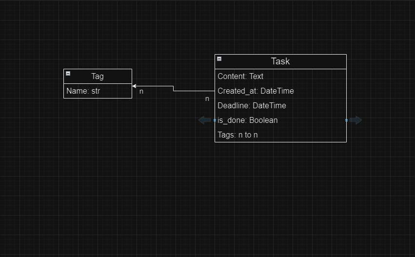

# ToDo List

ToDo List is a simple web application for managing tasks. It allows users to create, update, delete, and toggle the completion status of tasks. Additionally, users can categorize tasks using tags.

## Features

- **Task Management**: Create, read, update, and delete tasks.
- **Toggle Task Status**: Mark tasks as done or not done.
- **Tag Management**: Create, update, delete, and list tags.
- **Task Ordering**: Tasks are ordered by their completion status and creation date.

## DB schema


## Requirements

- Python 3.11.2
- Django 5.0.6 or higher
- Bootstrap 4 (for frontend styling)

## Installation

1. **Clone the repository**:

   ```bash
   git clone https://github.com/SpecializedBaby/todo-list.git
   cd todo-list
   ```
2. Create a virtual environment and activate it:

```bash
python -m venv venv
source venv/bin/activate   # On Windows, use `venv\Scripts\activate`
```

3. Install the dependencies:

```bash
pip install -r requirements.txt
```

4. Apply migrations:

```bash
python manage.py migrate
```

5. Create a superuser:

```bash
python manage.py createsuperuser
```

6. Run the development server:

```bash
python manage.py runserver
```

Visit http://127.0.0.1:8000/ in your web browser to access ToDO List.

## Usage
### Task Management
- **Create a Task:** Navigate to the task list and click on "Create". Fill out the form and submit.
- **Update a Task:** Click on the "Update" link next to a task to edit its details.
- **Delete a Task:** Click on the "Delete" link next to a task to remove it.
- **Toggle Task Status:** Click on the "Complete" or "Undo" button next to a task to change its completion status.
### Tag Management
- **View Tags:** Navigate to the tag list to view all tags.
- **Create a Tag:** Click on "Add Tag" to create a new tag.
- **Update a Tag:** Click on the "Update" link next to a tag to edit its details.
- **Delete a Tag:** Click on the "Delete" link next to a tag to remove it.
- 
## Project Structure
- **task_manager:** Contains the main application code.
- - **models.py:** Defines the Task and Tag models.
- - **views.py:** Contains view logic for handling requests.
- - **urls.py:** URL configuration for the app.
- - **templates/task_manager:** Contains HTML templates for tasks and tags.

## Contributing
Contributions are welcome! Please fork the repository and create a pull request with your changes.

## License
This project is licensed under the MIT License. See the LICENSE file for details.

## Acknowledgments
- [Bootstrap](https://getbootstrap.com/docs/4.5/getting-started/introduction/) for the responsive design framework.
- [Django](https://www.djangoproject.com/) for the robust web framework.

## Contact
For any inquiries, please contact us at specialized8393@gmail.com